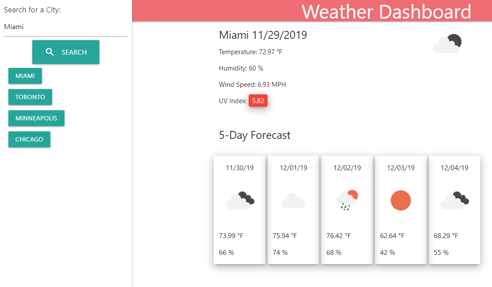
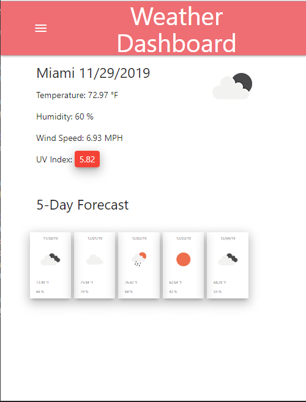

# Weather Dashboard

## Description 
Repository created to develop a site that utilizes a weather API to show the current weather in a city and the 5 day forecast. This is homework six for my web development boot camp. Previous searches are saved to local storage. Clicking a previously search city causes the city weather to be displayed. If there is data in the local storage, the most recently searched city will be displayed when visiting the site. Side nav bar collapses when the screen/window size reaches a certain size. I used materilize for the first time to style this site.

## Live site: 
https://sirpotatoiv.github.io/wut-da-weather/

## Images:
View with navbar not collapsed on medium/large windows/screens:

View with navbar collapsed on windows/screens smaller than medium:

## Installation 
If all files are kept in a single folder a web browser should be able to run the project and you have an internet connection.

## Usage 
The usage of this is just for me to practice HTML, CSS, and javascript. It could be used to check the weather.

## Credits 
I created this code based on the homework prompt created by Triology Education Services. Certain pieces of code I used online resources for help. In addition, several portions of code were created based on in class activities. I have included citations in the form of comments throughout the html and javascript.

## Contributing 
I was the only one to work on this project, but of course I had help from my instructor, TA's, and classmates.

## Challenges
I made the poor decision of trying to learn a new CSS framework the night the homework was due. This caused me constant delays while trying to get all the data I had succesfully gotten from the api to dispaly in the html. As always, I ran into unforseen complications that required more time than I had to complete the homework. The code was broken and barely usuable when I submitted it. I took the time over the Thanksgiving holiday weekend to read through materilize more and correct my code. I think a good chunk of my mistakes were due to scrambling at the last minute and being burnt out. The javascript portion I struggled with, which I have in the past, was generating html and referencing that generated html later in the code. I figured out how to create unique ids that were easy to reference later in the loops used to generate the html.

## License
[MIT](https://choosealicense.com/licenses/mit/)
